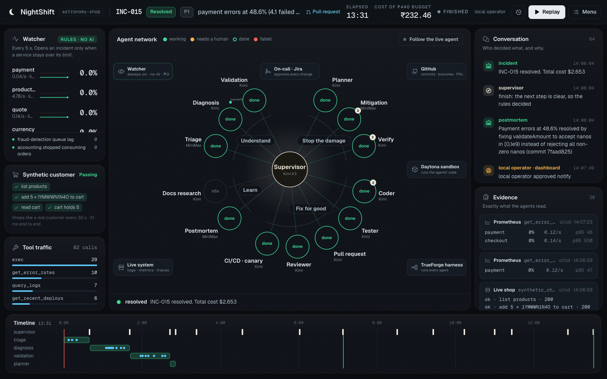
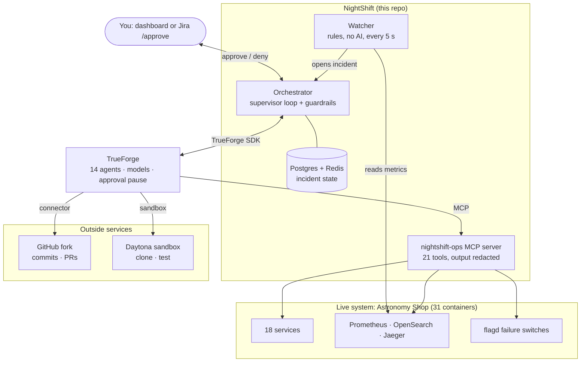
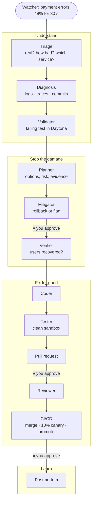
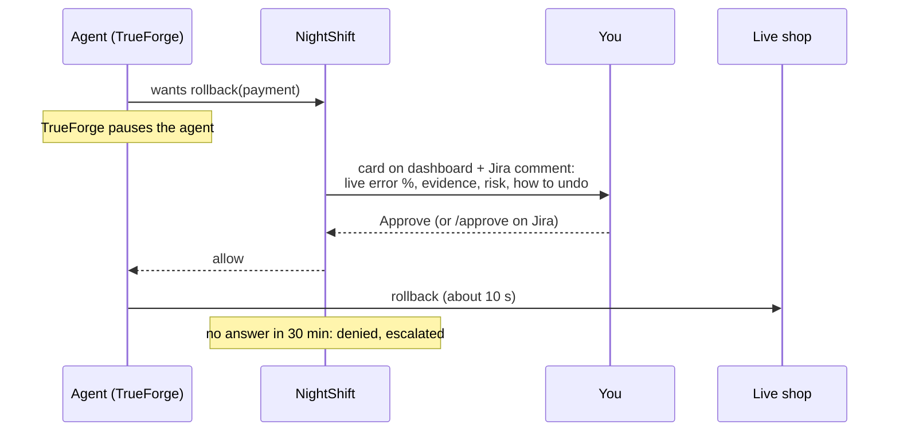
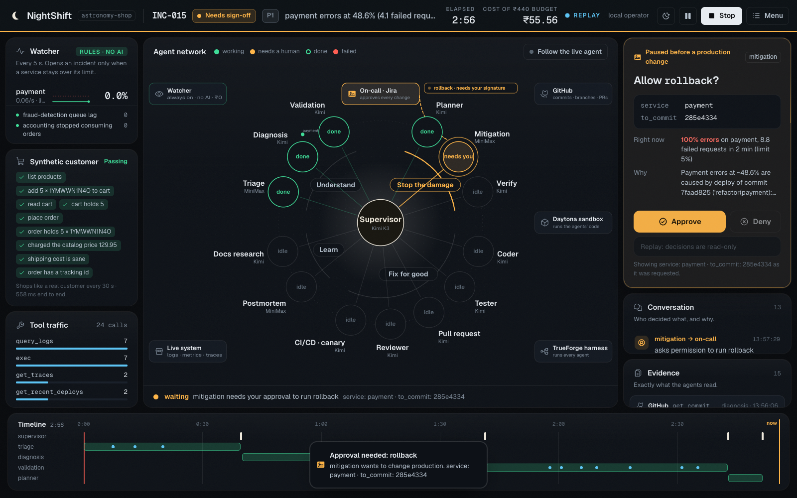

# NightShift

**An on-call team of AI agents that finds, proves and fixes production incidents, and asks a person before every change.**

Built on [TrueForge](https://github.com/truefoundry/trueforge) for **Agents That Act** (TrueFoundry × Polaris, Bengaluru, 26 September 2026).



When production breaks at 3 AM, an engineer has to find the cause, stop the damage and ship a fix, alone. NightShift does that work and leaves the engineer only the decisions.

- **Watch:** plain rules (no AI, ₹0 while quiet) read the live system's metrics every 5 seconds.
- **Understand:** agents read real logs, traces and commits, then prove the cause with a failing test in a sandbox.
- **Stop the damage:** a rollback or flag change, then a check that users really recovered.
- **Fix for good:** a code fix, tested, opened as a pull request, reviewed, merged, shipped as a 10% canary, then promoted.
- **Every change waits for you:** approve on the dashboard or reply `/approve` on the Jira ticket.

---

## Architecture



| Part | What it is | Why it exists |
|---|---|---|
| **Watcher** (`control/watcher.py`) | Rules on error rates, per-endpoint failures, Kafka lag, a test customer that really checks out, and "is monitoring itself alive?" | Cheap and always on. AI starts only when a problem is large, real and lasting. |
| **TrueForge agents** (`agents/*.json`) | 14 agents, one job each, each with only the tools it needs | TrueForge runs the models, tools, sandbox, sub-agents and the approval pause. |
| **Supervisor + guardrails** (`control/orchestrator.py`) | An AI supervisor picks the next move. Code checks every move: order, attempt limits, budget, "no finish before the fix ships". | The agents talk to each other, but they cannot skip safety. |
| **nightshift-ops MCP** (`mcp/ops/`) | The only door to the live system: metrics, logs, traces, deploys, flags, read-only SQL, rollback, canary | One place to redact secrets and gate every change. |
| **Onboarding file** (`systems/astronomy-shop.yaml`) | Services, limits, dependencies, repo, telemetry URLs | A new system needs a new file, not new agent code. |
| **System map** (`systems/*.map.md`) | Built from the repo: what each service serves, who calls it, main files, tests | Agents start knowing the architecture instead of rediscovering it. |
| **Dashboard** (`control/ui/`) | The agent network live: click any agent to see its answer, evidence and every tool call | So a person can follow and trust what the agents do. |

## How an incident flows



The supervisor sits over all of this. It can run an agent, ask one a question, send work back (for example, "the reviewer wants changes"), hand over to you, or finish. It is called only when there is a real choice. Clear next steps are decided by the rules, which saves time and money.

## Every change asks you first





**Other safety rules, enforced in code:**
- Only the tools each agent needs.
- Code runs only in the sandbox: no secrets, no access to production.
- Evidence must match real tool output, or it is marked unverified.
- A PR link or a "promoted" claim is accepted only if the real tool returned it.
- A second change is not made while live numbers look healthy.
- Unfinished incidents continue after a restart.

## Why the Astronomy Shop

We needed a **real** system to prove the agents act, not a toy. The [OpenTelemetry Astronomy Shop](https://github.com/open-telemetry/opentelemetry-demo) is an open-source e-commerce app used as the reference system for observability:

- 31 containers in 12 languages, with real Kafka, Postgres and gRPC
- full metrics, logs and traces
- 18 built-in failure switches

Our fork ([aryan-2255/opentelemetry-demo](https://github.com/aryan-2255/opentelemetry-demo)) is where the agents read commits and open their fix PRs. NightShift itself doesn't depend on the shop: it only knows the shop through `systems/astronomy-shop.yaml`.

---

## Repository layout

```
SRE_agent/
├── nightshift/                 the project
│   ├── agents/                 14 TrueForge agent specs (JSON) + table in agents/README.md
│   ├── control/                watcher, orchestrator + supervisor guardrails, approvals, Jira bridge, API
│   │   ├── ui/                 dashboard (React, Vite, Tailwind, Motion)
│   │   └── web/                earlier static dashboard (fallback)
│   ├── mcp/ops/                nightshift-ops MCP server and adapters (Prometheus, OpenSearch, Jaeger, Docker Compose, flagd)
│   ├── systems/                onboarding file + generated system map per watched system
│   ├── skills/                 TrueForge skills: sandbox toolchains, runbooks, postmortem template
│   ├── chaos/                  break the shop on purpose, and restore it
│   ├── evals/                  8 break scenarios, scored automatically
│   ├── tests/                  guardrail tests (no models needed)
│   ├── scripts/                bootstrap, start/stop, TrueForge setup, system map, MCP CLI
│   ├── docs/                   manual test guide, architecture page, images
│   └── compose.yaml            ops-mcp, payment-lb (canary), Postgres, Redis
├── astronomy-shop/             the shop (git submodule → aryan-2255/opentelemetry-demo)
└── plan/                       the build plan and interface contracts
```

## Run it yourself

### What you need

| Need | Version / notes |
|---|---|
| macOS or Linux | tested on macOS (Apple silicon) |
| Docker Desktop | **10 GB+ memory**, about 20 GB free disk |
| Node.js | 22.14+ (TrueForge and the dashboard) |
| Python | 3.12+ |
| A model provider in TrueForge | any provider TrueForge supports; we use Amazon Bedrock (MiniMax M2.5 + Kimi K3) |
| Daytona API key | the sandbox where agents run code |
| GitHub fine-grained token | only for **your fork of the shop**: Contents RW, Pull requests RW |
| Jira (optional) | approvals by `/approve` comment; the dashboard works without it |

Python packages are in `nightshift/requirements.txt` and dashboard packages in `nightshift/control/ui/package.json`. Bootstrap installs both.

### Steps

```bash
# 1. Fork both repos on GitHub: SRE_agent and opentelemetry-demo. Then clone yours with the shop inside:
git clone --recursive https://github.com/<you>/SRE_agent.git nightshift-demo
cd nightshift-demo
git -C astronomy-shop remote set-url origin https://github.com/<you>/opentelemetry-demo.git

# 2. Point NightShift at your shop fork: edit nightshift/systems/astronomy-shop.yaml → repo.url

# 3. Everything local: .env with fresh tokens, Python venv, the shop's 31 containers,
#    NightShift's containers, the system map and the dashboard build
cd nightshift
./scripts/bootstrap.sh

# 4. Start TrueForge + NightShift (both restart themselves if they crash)
./scripts/nightshift.sh start
```

5. Open TrueForge at http://localhost:8790 → **Settings** and add:
   - **Models:** a provider with a small and a strong model.
   - **Sandbox:** your Daytona key.
   - **Connectors → GitHub:** your fork token.
   - **Connectors → Jira:** optional.
6. Load the 14 agents and the ops server into TrueForge:
   ```bash
   ./.venv/bin/python scripts/setup_trueforge.py
   ```
7. Open the dashboard at http://localhost:8090.

Detailed setup and troubleshooting are in [nightshift/SETUP.md](nightshift/SETUP.md). Secrets stay in `nightshift/.env` and in TrueForge; neither is in git.

### Try it

```bash
./chaos/prebuild.sh && ./chaos/break.sh payment-bug   # push a real bad commit: orders with cents fail
# watch http://localhost:8090, approve each step; about 15 minutes to a merged, canaried fix
./chaos/fix.sh && git -C ../astronomy-shop push origin main   # restore the shop afterwards
```

Quick incidents without code changes: `./chaos/break.sh payment-flag`, or any of the shop's failure switches. The step-by-step guide is in [nightshift/docs/MANUAL-TEST.md](nightshift/docs/MANUAL-TEST.md).

| Command | What it checks |
|---|---|
| `./.venv/bin/python -m pytest -q tests` | 21 guardrail tests, under a second, no models |
| `./.venv/bin/python evals/run.py` | breaks the shop 8 ways and scores detection, cause, first change and cost |
| `cd control/ui && npm run audit` | Playwright: every dashboard state, 3 screen sizes, both themes |

### Ports

| Port | Service |
|---|---|
| 8090 | NightShift dashboard + API |
| 8790 | TrueForge |
| 8080 | the shop (plus `/grafana`, `/jaeger`, `/feature`) |
| 8000 | nightshift-ops MCP server (localhost only) |
| 9090 | Prometheus |
| 5433 / 6380 | NightShift Postgres / Redis |

---

## Results (26 September 2026)

| Scenario | Found in | Right cause | First change asked | Cost |
|---|---|---|---|---|
| Real bad commit in payment | 81 s | ✓ commit + line | rollback, then PR merged and canary promoted | $2.65 |
| Payment failing 50% (flag) | 122 s | ✓ | flag off | $0.24 |
| Payment unreachable | 97 s | ✓ | flag off | $0.34 |
| Cart endpoint failing | 113 s | ✓ | flag off | $0.28 |
| Product catalog failing | 103 s | ✓ | flag off | $0.31 |
| Ad service failing | 67 s | ✓ | flag off | $0.22 |
| Kafka consumer lag | ~5 min (lag builds slowly) | ✓ | flag off | $0.21 |
| One bad request | not opened (correct) | | | $0 |
| Monitoring itself down | 75 s | ✓ otel-collector | restart | $0.43 |

## Built with

TrueForge 0.2.1 (unmodified) · TrueForge Python SDK · MCP (FastMCP) · FastAPI · Postgres · Redis · Docker Compose · Daytona · React 19 + Vite + Tailwind 4 + Motion · Playwright.
Models at runtime: MiniMax M2.5 and Kimi K3 on Amazon Bedrock.

## AI tools used to build this

Claude Code (Anthropic, Claude Opus 5.5) helped design and write the code, scripts and documentation. The team reviewed, ran and tested everything and can explain every part.

## Credits

- Architecture inspired by Bhavishya Pandit's SRE-agent talk at a Google event.
- Target system: [OpenTelemetry Astronomy Shop](https://github.com/open-telemetry/opentelemetry-demo) (Apache-2.0).
- Agent harness: [TrueForge](https://github.com/truefoundry/trueforge) by TrueFoundry (MIT).
- Dashboard design: Aarnav Mathakiya.
